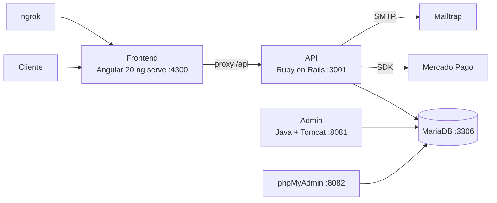

cat > ~/TRIP-BUS-NATIONAL/README.md << 'READMEEOF'
# 🚌 Trip Bus National — Passagens de Ônibus & Reservas de Hotel

[](https://www.docker.com/)
[](https://angular.io/)
[](https://rubyonrails.org/)
[](https://www.java.com/)
[](https://mariadb.org/)
[](https://www.mercadopago.com.br/)

Plataforma de **venda de passagens de ônibus e reservas de hotel**, com pagamento online (Mercado Pago), autenticação com JWT, e-mails transacionais e um **painel administrativo em Java/Tomcat**. Arquitetura poliglota de serviços **100% dockerizados** (Angular + Rails + Java + MariaDB).

---

## 📑 Índice

- [Funcionalidades](#-funcionalidades)
- [Arquitetura](#️-arquitetura)
- [Tecnologias](#-tecnologias)
- [Estrutura de diretórios](#-estrutura-de-diretórios)
- [Backend (Rails) em detalhe](#-backend-ruby-on-rails-em-detalhe)
- [Frontend (Angular) em detalhe](#-frontend-angular-em-detalhe)
- [Painel Admin (Java/Tomcat) em detalhe](#-painel-admin-javatomcat-em-detalhe)
- [Serviços Docker](#-serviços-docker)
- [Configuração (.env)](#️-configuração-env)
- [Como executar](#️-como-executar)
- [Portas e acessos](#-portas-e-acessos)
- [Testando pagamentos](#-testando-pagamentos)
- [Comandos úteis](#-comandos-úteis)
- [Segurança](#-segurança)

---

## ✨ Funcionalidades

- 🚌 **Passagens de ônibus** — busca de viagens (origem, destino, data), seleção de poltronas e compra.
- 🏨 **Reservas de hotel** — reserva por período (check-in/check-out) e tipo de quarto.
- 🔐 **Autenticação completa** (Devise + JWT) — cadastro, login, esqueci/redefinir senha, com olhinho mostrar/ocultar senha.
- 💳 **Pagamento via Mercado Pago** — Checkout Pro (cartão) e PIX, com **retorno automático** (`auto_return`) e **webhook** de confirmação.
- 📧 **E-mail de confirmação** — enviado após a aprovação do pagamento (SMTP/Mailtrap).
- 🗂️ **Histórico de reservas** — passagens e hotéis, com **cancelar** e **excluir**.
- ☕ **Painel administrativo** — módulo em Java/Tomcat (dashboard, usuários, cancelamentos).
- 🍪 **Consentimento de cookies** (LGPD).

---

## 🏗️ Arquitetura



| Serviço | Papel | Stack |
|---|---|---|
| **frontend** | Interface do usuário (SPA) | Angular 20 (`ng serve`) |
| **api** | Regras de negócio, auth e pagamentos | Ruby on Rails (API) |
| **admin-java** | Painel administrativo | Java + Apache Tomcat (JDBC) |
| **db** | Banco de dados | MariaDB |
| **phpmyadmin** | Administração visual do banco | phpMyAdmin |
| **ngrok** | Túnel público (retorno do pagamento) | ngrok |

> O frontend chama a API por caminho relativo `/api`, e o `ng serve` faz o proxy para o backend — assim o mesmo host serve a página e a API (essencial para o retorno do Mercado Pago funcionar via URL pública).

---

## 🚀 Tecnologias

- **Frontend:** Angular 20 (standalone + SSR), Tailwind CSS, SASS, Font Awesome, TypeScript, RxJS.
- **API:** Ruby on Rails (modo API), Devise + JWT, SDK do Mercado Pago.
- **Admin:** Java, Apache Tomcat, JDBC.
- **Banco:** MariaDB + phpMyAdmin.
- **Infra:** Docker, Docker Compose, WSL2, ngrok.

---

## 📂 Estrutura de diretórios

```
TRIP-BUS-NATIONAL/
├── WEB-FRONTEND-ANGULAR/            # Frontend Angular 20 (SPA, ng serve)
│   ├── src/app/
│   │   ├── services/               # auth, reserva, hotel, trip, carrinho, cookie...
│   │   ├── checkout/               # etapas: endereço, frete, pagamento, revisão
│   │   ├── pages/                  # historico, login, register, minha-conta...
│   │   └── components/             # banners, carrossel, botões compartilhados
│   ├── src/interfaces/             # Iproduto, IprodutoCarrinho
│   └── proxy.conf.json             # proxy /api -> api:3000
├── API-RUBY-RAILS/                 # API em Ruby on Rails
│   └── app/
│       ├── controllers/api/v1/     # reservas, hotels, hotel_reservas, trips, users, auth
│       ├── models/                 # Trip, Reserva, Assento, Hotel, HotelReserva, User, Order
│       ├── services/               # MercadoPagoService, JwtService
│       └── mailers/                # ReservaMailer, PedidoMailer, UserMailer
├── ADMIN-JAVA-TOMCAT/              # Painel administrativo (Java/Tomcat)
│   ├── src/main/java/com/tripbus/  # servlets, model, db (JDBC)
│   └── src/main/webapp/            # JSPs + WEB-INF
├── docker-compose.yml              # orquestração dos serviços
└── .env.example                    # modelo das variáveis de ambiente
```

---

## 🧠 Backend (Ruby on Rails) em detalhe

**Models (`app/models/`)**
- `Trip` — viagem/linha de ônibus (origem, destino, data, preço, detalhes).
- `Assento` — poltrona de uma viagem.
- `Reserva` — reserva de passagem (viajante, pagamento, `preference_id` do MP).
- `Hotel` e `HotelReserva` — hotéis e suas reservas (período, quarto).
- `User` — usuário (Devise + JWT, CPF, reset de senha).
- `Order` — pedido/registro de compra.

**Controllers (`app/controllers/api/v1/`)**
- `TripsController` — lista e detalha viagens disponíveis.
- `ReservasController` — cria reserva, `confirmar_pagamento`, `destroy` (excluir) e `webhook` (público) do Mercado Pago.
- `HotelsController` / `HotelReservasController` — hotéis e reservas de hotel.
- `UsersController` — dados do usuário.
- `AuthController` / `auth_register` / `auth/forgot_password` / `auth/reset_password` — autenticação e recuperação de senha.
- `CheckoutsController` — apoio ao fluxo de pagamento.

**Services (`app/services/`)**
- `MercadoPagoService` — cria a preferência de pagamento da reserva (`criar_preferencia_reserva`), com `auto_return` e `notification_url` (webhook).
- `JwtService` — geração e validação dos tokens JWT.

**Mailers (`app/mailers/`)**
- `ReservaMailer` — `confirmacao_pagamento`: e-mail com o código da passagem após o pagamento aprovado.
- `PedidoMailer`, `UserMailer` — confirmação de pedido e redefinição de senha.

**Migrations (`db/migrate/`)** — criam `trips`, `users`, `orders`, `reservas`, `assentos`, `hotels`, `hotel_reservas`, além de campos de CPF, reset de senha, dados do viajante/pagamento e `preference_id`.

**Rotas (`config/routes.rb`)**
- Auth (Devise + JWT): `login`, `signup`, `password`.
- `resources :reservas` + `destroy` e `collection { post :webhook }`.
- `resources :hotels`, `hotel_reservas`, `trips`, `users`.

---

## 🎨 Frontend (Angular) em detalhe

**Serviços (`src/app/services/`)**
- `AuthService` (+ `auth.interceptor`) — login/cadastro, guarda o token JWT e injeta o `Authorization` nas requisições.
- `ReservaService` — cria e lista reservas de passagem; exclui do histórico.
- `HotelService` / `HotelReservaService` — hotéis e reservas de hotel.
- `TripService` — busca de viagens.
- `CarrinhoService` / `CartService` — carrinho de passagens.
- `PedidoService`, `CancelamentoService`, `CookieService`, `NotificacaoService`.

**Checkout em etapas (`src/app/checkout/`)**
- `progress-bar`, `step-cart`, `step-address`, `step-delivery` (`frete`), `step-payment`, `step-review`, `step-complete` — o fluxo completo de finalização.

**Páginas (`src/app/pages/`)**
- `historico` (reservas com cancelar/excluir), `login`, `register`, `forgot-password`, `reset-password`, `minha-conta`, `cancelamentos`, `central-ajuda`, `pagamento-retorno`, `sobre-nos`, `termos-uso`, `privacidade`, `nao-encontrado`.

**Componentes visuais (`src/app/components/`)** — banners (`banner-samba` com slides, `banner-belo-horizonte`, `banner-buser4`), `image-carousel`, `shared/button-tropical`; além de `header`, `footer`, `home`, `hotel`, `tickets`, `buscar`, `cookie-banner`, `cookie-panel` e páginas de destinos (Belo Horizonte, Rio de Janeiro, São Paulo).

**Interfaces (`src/interfaces/`)** — `Iproduto` e `IprodutoCarrinho`.

**Proxy (`proxy.conf.json`)** — encaminha `/api` para `http://api:3000` durante o `ng serve`.

---

## ☕ Painel Admin (Java/Tomcat) em detalhe

Módulo administrativo independente (`ADMIN-JAVA-TOMCAT/`), servido pelo Apache Tomcat e conectado ao MariaDB via **JDBC**.

**Java (`src/main/java/com/tripbus/`)**
- `db/DBConnection.java` — conexão JDBC com o MariaDB.
- `model/User.java` — modelo de usuário do admin.
- `servlet/DashboardServlet.java` — painel/visão geral.
- `servlet/UsersServlet.java` — gestão de usuários.
- `servlet/CancelServlet.java` — cancelamentos.

**Web (`src/main/webapp/`)**
- `index.jsp` e `jsp/` — telas: `dashboard.jsp`, `users.jsp`, `cancelamentos.jsp`, `header.jsp`, `footer.jsp`.
- `WEB-INF/web.xml` — mapeamento dos servlets.
- `META-INF/context.xml` — configuração do datasource.

**Build:** `pom.xml` (Maven) + `Dockerfile` (empacota o `.war` no Tomcat).

---

## 🐳 Serviços Docker

| Serviço | Imagem/Build | Porta | Função |
|---|---|---|---|
| `db` | MariaDB | 3306 | Banco de dados |
| `api` | build da API | 3001→3000 | API Rails |
| `frontend` | build do frontend | 4300→4200 | Angular (`ng serve`) |
| `admin-java` | build do admin | 8081→8080 | Painel Java/Tomcat |
| `phpmyadmin` | phpmyadmin | 8082 | Administração do banco |
| `ngrok` | ngrok/ngrok | — | Túnel público (retorno do pagamento) |

---

## ⚙️ Configuração (.env)

Crie um arquivo `.env` na raiz (baseie-se no `.env.example`, se presente):

| Variável | Descrição |
|---|---|
| `DB_ROOT_PASSWORD`, `DB_NAME`, `DB_USERNAME`, `DB_PASSWORD` | Credenciais do MariaDB |
| `JWT_SECRET` | Segredo para assinar os tokens JWT |
| `MP_ACCESS_TOKEN` | Token do Mercado Pago (Checkout Pro / cartão) |
| `MP_PIX_ACCESS_TOKEN` | Token do Mercado Pago (PIX) |
| `MP_NOTIFICATION_URL` | URL pública do webhook (via ngrok) |
| `FRONTEND_URL` | URL do frontend (ngrok para o retorno automático) |
| `SMTP_*`, `MAILER_*` | Credenciais do Mailtrap (e-mail) |
| `NGROK_AUTHTOKEN` | Token da conta ngrok |

> ⚠️ O `.env` nunca vai para o Git. Versione apenas um `.env.example` (sem valores reais).

---

## ▶️ Como executar

```bash
# 1. Clone
git clone https://github.com/santhiago4343434343/TRIP-BUS-NATIONAL-VERSION-FINISHED.git
cd TRIP-BUS-NATIONAL-VERSION-FINISHED

# 2. Configure o .env (veja a tabela acima)

# 3. Suba os containers
docker compose up -d

# 4. Acompanhe a compilação do frontend (aguarde "Compiled successfully")
docker compose logs -f frontend
```

Depois abra **http://localhost:4300**.

> 💡 O `ng serve` leva alguns segundos para compilar na primeira vez — espere o `Compiled successfully` antes de abrir a página.

---

## 🌐 Portas e acessos

| Serviço | URL |
|---|---|
| Frontend (site) | http://localhost:4300 |
| API (Rails) | http://localhost:3001 |
| Painel Admin (Tomcat) | http://localhost:8081 |
| phpMyAdmin | http://localhost:8082 |
| MariaDB | `localhost:3306` |

---

## 💳 Testando pagamentos

- **Mercado Pago (sandbox):** pague logado com um Comprador de teste, cartão com titular `APRO` e CPF `12345678909`.
- **PIX:** aprovação via simulação de sandbox.
- **Retorno automático + e-mail:** o Mercado Pago não redireciona para `localhost`; o serviço `ngrok` expõe o frontend numa URL pública para o `auto_return` e o webhook funcionarem. Ao aprovar, a reserva é confirmada e o e-mail cai no Mailtrap.

---

## 🧰 Comandos úteis

```bash
docker compose ps                 # o que está rodando
docker compose logs -f frontend   # logs do frontend (ng serve)
docker compose logs -f api        # logs da API
docker compose stop               # pausa tudo (sem apagar dados)
docker compose up -d --build      # rebuilda e sobe
```

---

## 🔒 Segurança

- Segredos ficam apenas no `.env` (ignorado pelo Git).
- **Pagamento:** os dados do cartão não passam pela aplicação — o checkout é delegado ao Mercado Pago (boa prática PCI-DSS).

---

> Projeto de estudo — arquitetura poliglota dockerizada integrando frontend, API, painel administrativo em Java, banco de dados e gateway de pagamento. 🚌💨


# 🚌 Trip Bus National — Passagens de Ônibus & Reservas de Hotel

[](https://www.docker.com/)
[](https://angular.io/)
[](https://rubyonrails.org/)
[](https://www.java.com/)
[](https://mariadb.org/)
[](https://www.mercadopago.com.br/)

Plataforma de **venda de passagens de ônibus e reservas de hotel**, com pagamento online (Mercado Pago), autenticação com JWT, e-mails transacionais e um **painel administrativo em Java/Tomcat**. Arquitetura poliglota de serviços **100% dockerizados** (Angular + Rails + Java + MariaDB).

---

## 📑 Índice

- [Funcionalidades](#-funcionalidades)
- [Arquitetura](#️-arquitetura)
- [Tecnologias](#-tecnologias)
- [Estrutura de diretórios](#-estrutura-de-diretórios)
- [Backend (Rails) em detalhe](#-backend-ruby-on-rails-em-detalhe)
- [Frontend (Angular) em detalhe](#-frontend-angular-em-detalhe)
- [Painel Admin (Java/Tomcat) em detalhe](#-painel-admin-javatomcat-em-detalhe)
- [Serviços Docker](#-serviços-docker)
- [Configuração (.env)](#️-configuração-env)
- [Como executar](#️-como-executar)
- [Portas e acessos](#-portas-e-acessos)
- [Testando pagamentos](#-testando-pagamentos)
- [Comandos úteis](#-comandos-úteis)
- [Segurança](#-segurança)

---

## ✨ Funcionalidades

- 🚌 **Passagens de ônibus** — busca de viagens (origem, destino, data), seleção de poltronas e compra.
- 🏨 **Reservas de hotel** — reserva por período (check-in/check-out) e tipo de quarto.
- 🔐 **Autenticação completa** (Devise + JWT) — cadastro, login, esqueci/redefinir senha, com olhinho mostrar/ocultar senha.
- 💳 **Pagamento via Mercado Pago** — Checkout Pro (cartão) e PIX, com **retorno automático** (`auto_return`) e **webhook** de confirmação.
- 📧 **E-mail de confirmação** — enviado após a aprovação do pagamento (SMTP/Mailtrap).
- 🗂️ **Histórico de reservas** — passagens e hotéis, com **cancelar** e **excluir**.
- ☕ **Painel administrativo** — módulo em Java/Tomcat (dashboard, usuários, cancelamentos).
- 🍪 **Consentimento de cookies** (LGPD).

---

## 🏗️ Arquitetura


| Serviço | Papel | Stack |
|---|---|---|
| **frontend** | Interface do usuário (SPA) | Angular 20 (`ng serve`) |
| **api** | Regras de negócio, auth e pagamentos | Ruby on Rails (API) |
| **admin-java** | Painel administrativo | Java + Apache Tomcat (JDBC) |
| **db** | Banco de dados | MariaDB |
| **phpmyadmin** | Administração visual do banco | phpMyAdmin |
| **ngrok** | Túnel público (retorno do pagamento) | ngrok |

> O frontend chama a API por caminho relativo `/api`, e o `ng serve` faz o proxy para o backend — assim o mesmo host serve a página e a API (essencial para o retorno do Mercado Pago funcionar via URL pública).

---

## 🚀 Tecnologias

- **Frontend:** Angular 20 (standalone + SSR), Tailwind CSS, SASS, Font Awesome, TypeScript, RxJS.
- **API:** Ruby on Rails (modo API), Devise + JWT, SDK do Mercado Pago.
- **Admin:** Java, Apache Tomcat, JDBC.
- **Banco:** MariaDB + phpMyAdmin.
- **Infra:** Docker, Docker Compose, WSL2, ngrok.

---

## 📂 Estrutura de diretórios

```
TRIP-BUS-NATIONAL/
├── WEB-FRONTEND-ANGULAR/            # Frontend Angular 20 (SPA, ng serve)
│   ├── src/app/
│   │   ├── services/               # auth, reserva, hotel, trip, carrinho, cookie...
│   │   ├── checkout/               # etapas: endereço, frete, pagamento, revisão
│   │   ├── pages/                  # historico, login, register, minha-conta...
│   │   └── components/             # banners, carrossel, botões compartilhados
│   ├── src/interfaces/             # Iproduto, IprodutoCarrinho
│   └── proxy.conf.json             # proxy /api -> api:3000
├── API-RUBY-RAILS/                 # API em Ruby on Rails
│   └── app/
│       ├── controllers/api/v1/     # reservas, hotels, hotel_reservas, trips, users, auth
│       ├── models/                 # Trip, Reserva, Assento, Hotel, HotelReserva, User, Order
│       ├── services/               # MercadoPagoService, JwtService
│       └── mailers/                # ReservaMailer, PedidoMailer, UserMailer
├── ADMIN-JAVA-TOMCAT/              # Painel administrativo (Java/Tomcat)
│   ├── src/main/java/com/tripbus/  # servlets, model, db (JDBC)
│   └── src/main/webapp/            # JSPs + WEB-INF
├── docker-compose.yml              # orquestração dos serviços
└── .env.example                    # modelo das variáveis de ambiente
```

---

## 🧠 Backend (Ruby on Rails) em detalhe

**Models (`app/models/`)**
- `Trip` — viagem/linha de ônibus (origem, destino, data, preço, detalhes).
- `Assento` — poltrona de uma viagem.
- `Reserva` — reserva de passagem (viajante, pagamento, `preference_id` do MP).
- `Hotel` e `HotelReserva` — hotéis e suas reservas (período, quarto).
- `User` — usuário (Devise + JWT, CPF, reset de senha).
- `Order` — pedido/registro de compra.

**Controllers (`app/controllers/api/v1/`)**
- `TripsController` — lista e detalha viagens disponíveis.
- `ReservasController` — cria reserva, `confirmar_pagamento`, `destroy` (excluir) e `webhook` (público) do Mercado Pago.
- `HotelsController` / `HotelReservasController` — hotéis e reservas de hotel.
- `UsersController` — dados do usuário.
- `AuthController` / `auth_register` / `auth/forgot_password` / `auth/reset_password` — autenticação e recuperação de senha.
- `CheckoutsController` — apoio ao fluxo de pagamento.

**Services (`app/services/`)**
- `MercadoPagoService` — cria a preferência de pagamento da reserva (`criar_preferencia_reserva`), com `auto_return` e `notification_url` (webhook).
- `JwtService` — geração e validação dos tokens JWT.

**Mailers (`app/mailers/`)**
- `ReservaMailer` — `confirmacao_pagamento`: e-mail com o código da passagem após o pagamento aprovado.
- `PedidoMailer`, `UserMailer` — confirmação de pedido e redefinição de senha.

**Migrations (`db/migrate/`)** — criam `trips`, `users`, `orders`, `reservas`, `assentos`, `hotels`, `hotel_reservas`, além de campos de CPF, reset de senha, dados do viajante/pagamento e `preference_id`.

**Rotas (`config/routes.rb`)**
- Auth (Devise + JWT): `login`, `signup`, `password`.
- `resources :reservas` + `destroy` e `collection { post :webhook }`.
- `resources :hotels`, `hotel_reservas`, `trips`, `users`.

---

## 🎨 Frontend (Angular) em detalhe

**Serviços (`src/app/services/`)**
- `AuthService` (+ `auth.interceptor`) — login/cadastro, guarda o token JWT e injeta o `Authorization` nas requisições.
- `ReservaService` — cria e lista reservas de passagem; exclui do histórico.
- `HotelService` / `HotelReservaService` — hotéis e reservas de hotel.
- `TripService` — busca de viagens.
- `CarrinhoService` / `CartService` — carrinho de passagens.
- `PedidoService`, `CancelamentoService`, `CookieService`, `NotificacaoService`.

**Checkout em etapas (`src/app/checkout/`)**
- `progress-bar`, `step-cart`, `step-address`, `step-delivery` (`frete`), `step-payment`, `step-review`, `step-complete` — o fluxo completo de finalização.

**Páginas (`src/app/pages/`)**
- `historico` (reservas com cancelar/excluir), `login`, `register`, `forgot-password`, `reset-password`, `minha-conta`, `cancelamentos`, `central-ajuda`, `pagamento-retorno`, `sobre-nos`, `termos-uso`, `privacidade`, `nao-encontrado`.

**Componentes visuais (`src/app/components/`)** — banners (`banner-samba` com slides, `banner-belo-horizonte`, `banner-buser4`), `image-carousel`, `shared/button-tropical`; além de `header`, `footer`, `home`, `hotel`, `tickets`, `buscar`, `cookie-banner`, `cookie-panel` e páginas de destinos (Belo Horizonte, Rio de Janeiro, São Paulo).

**Interfaces (`src/interfaces/`)** — `Iproduto` e `IprodutoCarrinho`.

**Proxy (`proxy.conf.json`)** — encaminha `/api` para `http://api:3000` durante o `ng serve`.

---

## ☕ Painel Admin (Java/Tomcat) em detalhe

Módulo administrativo independente (`ADMIN-JAVA-TOMCAT/`), servido pelo Apache Tomcat e conectado ao MariaDB via **JDBC**.

**Java (`src/main/java/com/tripbus/`)**
- `db/DBConnection.java` — conexão JDBC com o MariaDB.
- `model/User.java` — modelo de usuário do admin.
- `servlet/DashboardServlet.java` — painel/visão geral.
- `servlet/UsersServlet.java` — gestão de usuários.
- `servlet/CancelServlet.java` — cancelamentos.

**Web (`src/main/webapp/`)**
- `index.jsp` e `jsp/` — telas: `dashboard.jsp`, `users.jsp`, `cancelamentos.jsp`, `header.jsp`, `footer.jsp`.
- `WEB-INF/web.xml` — mapeamento dos servlets.
- `META-INF/context.xml` — configuração do datasource.

**Build:** `pom.xml` (Maven) + `Dockerfile` (empacota o `.war` no Tomcat).

---

## 🐳 Serviços Docker

| Serviço | Imagem/Build | Porta | Função |
|---|---|---|---|
| `db` | MariaDB | 3306 | Banco de dados |
| `api` | build da API | 3001→3000 | API Rails |
| `frontend` | build do frontend | 4300→4200 | Angular (`ng serve`) |
| `admin-java` | build do admin | 8081→8080 | Painel Java/Tomcat |
| `phpmyadmin` | phpmyadmin | 8082 | Administração do banco |
| `ngrok` | ngrok/ngrok | — | Túnel público (retorno do pagamento) |

---

## ⚙️ Configuração (.env)

Crie um arquivo `.env` na raiz (baseie-se no `.env.example`, se presente):

| Variável | Descrição |
|---|---|
| `DB_ROOT_PASSWORD`, `DB_NAME`, `DB_USERNAME`, `DB_PASSWORD` | Credenciais do MariaDB |
| `JWT_SECRET` | Segredo para assinar os tokens JWT |
| `MP_ACCESS_TOKEN` | Token do Mercado Pago (Checkout Pro / cartão) |
| `MP_PIX_ACCESS_TOKEN` | Token do Mercado Pago (PIX) |
| `MP_NOTIFICATION_URL` | URL pública do webhook (via ngrok) |
| `FRONTEND_URL` | URL do frontend (ngrok para o retorno automático) |
| `SMTP_*`, `MAILER_*` | Credenciais do Mailtrap (e-mail) |
| `NGROK_AUTHTOKEN` | Token da conta ngrok |

> ⚠️ O `.env` nunca vai para o Git. Versione apenas um `.env.example` (sem valores reais).

---

## ▶️ Como executar

```bash
# 1. Clone
git clone https://github.com/santhiago4343434343/TRIP-BUS-NATIONAL-VERSION-FINISHED.git
cd TRIP-BUS-NATIONAL-VERSION-FINISHED

# 2. Configure o .env (veja a tabela acima)

# 3. Suba os containers
docker compose up -d

# 4. Acompanhe a compilação do frontend (aguarde "Compiled successfully")
docker compose logs -f frontend
```

Depois abra **http://localhost:4300**.

> 💡 O `ng serve` leva alguns segundos para compilar na primeira vez — espere o `Compiled successfully` antes de abrir a página.

---

## 🌐 Portas e acessos

| Serviço | URL |
|---|---|
| Frontend (site) | http://localhost:4300 |
| API (Rails) | http://localhost:3001 |
| Painel Admin (Tomcat) | http://localhost:8081 |
| phpMyAdmin | http://localhost:8082 |
| MariaDB | `localhost:3306` |

---

## 💳 Testando pagamentos

- **Mercado Pago (sandbox):** pague logado com um Comprador de teste, cartão com titular `APRO` e CPF `12345678909`.
- **PIX:** aprovação via simulação de sandbox.
- **Retorno automático + e-mail:** o Mercado Pago não redireciona para `localhost`; o serviço `ngrok` expõe o frontend numa URL pública para o `auto_return` e o webhook funcionarem. Ao aprovar, a reserva é confirmada e o e-mail cai no Mailtrap.

---

## 🧰 Comandos úteis

```bash
docker compose ps                 # o que está rodando
docker compose logs -f frontend   # logs do frontend (ng serve)
docker compose logs -f api        # logs da API
docker compose stop               # pausa tudo (sem apagar dados)
docker compose up -d --build      # rebuilda e sobe
```

---

## 🔒 Segurança

- Segredos ficam apenas no `.env` (ignorado pelo Git).
- **Pagamento:** os dados do cartão não passam pela aplicação — o checkout é delegado ao Mercado Pago (boa prática PCI-DSS).

---

> Projeto de estudo — arquitetura poliglota dockerizada integrando frontend, API, painel administrativo em Java, banco de dados e gateway de pagamento. 🚌💨
